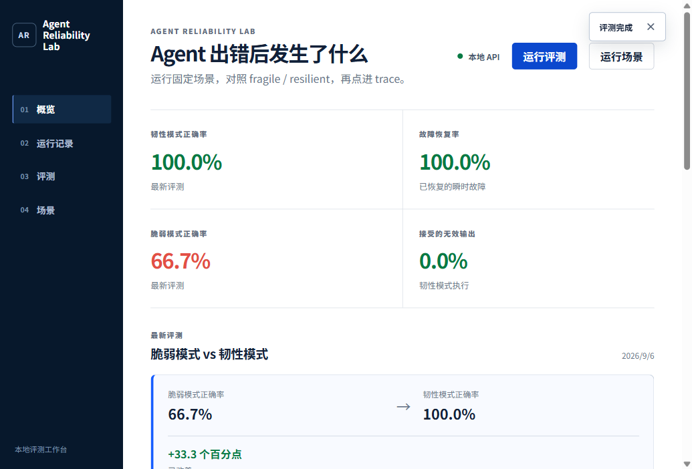
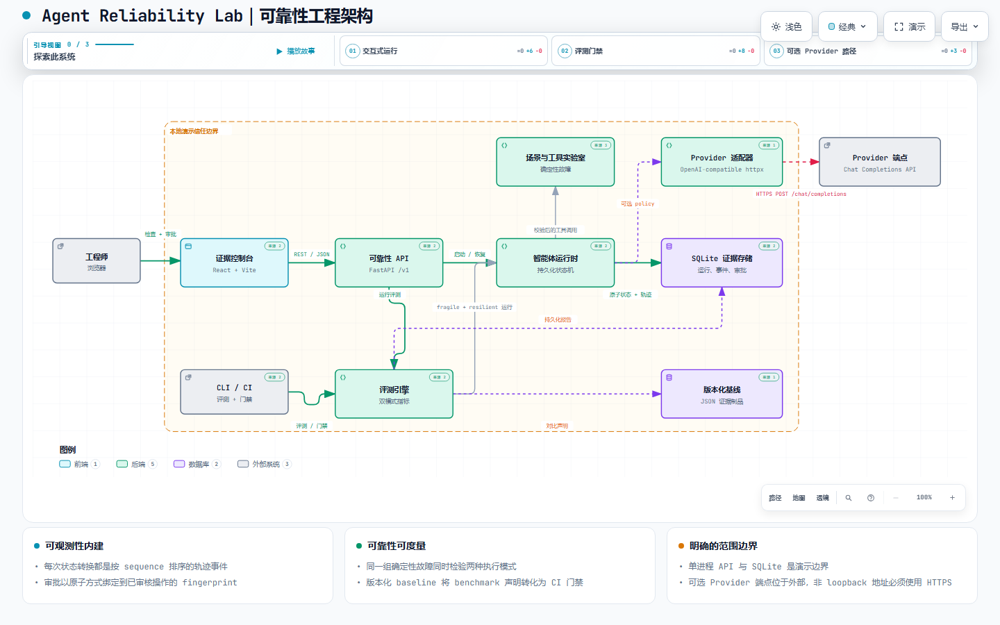
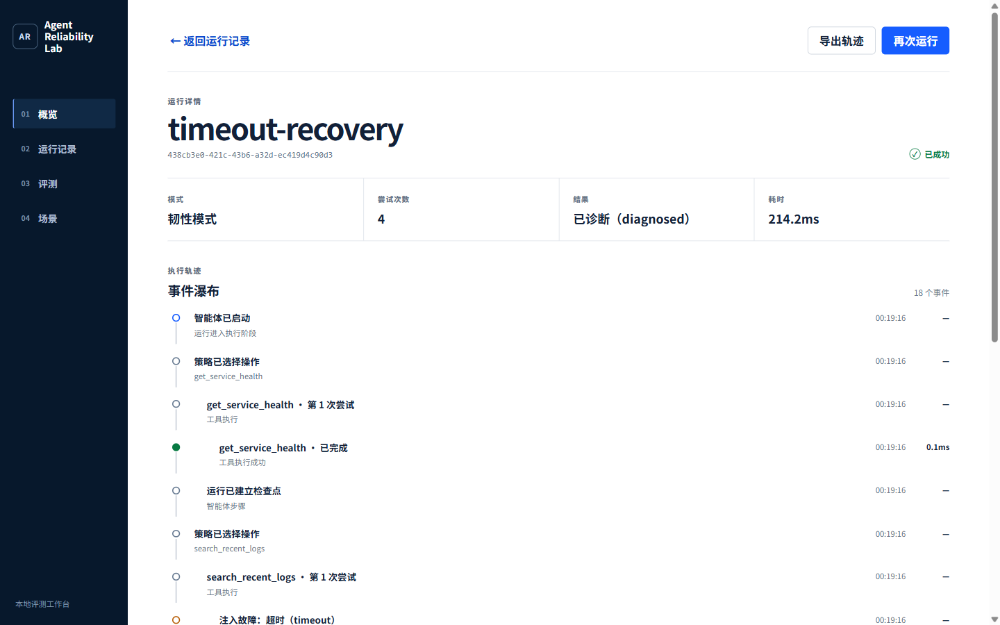

<h1 align="center">Agent Reliability Lab｜智能体可靠性实验室</h1>

<p align="center">用 6 个固定故障场景，看看 Agent 遇到超时、限流、审批和重启后会怎么走。</p>

<p align="center">
  <a href="https://github.com/SCUliujiacheng/agent-reliability-lab-zh/actions/workflows/ci.yml"></a>
  <a href="https://www.python.org/"></a>
  <a href="https://react.dev/"></a>
  <a href="LICENSE"></a>
</p>

<p align="center">
  <a href="#30-秒看结果">结果</a> ·
  <a href="#我想看的是失败以后">项目起点</a> ·
  <a href="#架构">架构</a> ·
  <a href="#在本地跑起来">运行</a> ·
  <a href="#评测与失败分析">评测证据</a> ·
  <a href="#五分钟技术导览">技术导览</a> ·
  <a href="https://github.com/SCUliujiacheng/agent-reliability-lab">English</a>
</p>

<p align="center">
  
</p>

<p align="center"><sub>页面上的评测、场景和 trace 都来自同一套本地 API。</sub></p>

## 我想看的是失败以后

工具调用成功时，很多 Agent demo 看起来都差不多。我更想看超时、限流、重启或审批卡住以后会发生什么：它能不能说清楚停在哪里，恢复时会不会多做一次事，最后留下的记录够不够别人核对。

这个仓库就是拿来反复跑这些情况的。状态、工具尝试、审批决定和 trace 都会保存下来，评测再从原始记录重算结果。当前范围只有本地单节点和合成场景，不是生产事故处理器。

## 30 秒看结果

同一套冻结的 6 个合成事故场景，在确定性 scripted policy 和本地 synthetic tools 下分别运行 `fragile` 与 `resilient` 两种模式；无需 API key、网络、GPU 或付费服务。

| 精确指标 | 脆弱模式（fragile） | 韧性模式（resilient） | 变化 |
| --- | ---: | ---: | ---: |
| 任务正确率 | 4 / 6 (66.7%) | 6 / 6 (100.0%) | **+33.3 个百分点** |
| 瞬时故障恢复率 | 0 / 2 (0.0%) | 2 / 2 (100.0%) | **+100.0 个百分点** |
| 工具序列准确率 | 94.4% | 100.0% | **+5.6 个百分点** |
| 接受的无效输出 | 0 | 0 | 无变化 |
| 非必要逻辑调用 | 0 | 0 | 无变化 |

差异来自首次调用的超时（`timeout`）与限流（`rate_limit`）：韧性模式会记录失败、在策略边界内重试并到达声明结果；脆弱模式在第一次失败后终止。指标不是手填摘要，而是由有序轨迹、套件/操作/输出哈希与版本化场景重新构建。

## 最后做成了什么

最后落到三个部分：

- 运行恢复：显式状态、checkpoint、optimistic version check 和 execution lease 负责从中断处继续；状态变化与对应事件写在同一个 SQLite 事务里。
- 工具与审批：Pydantic schema、timeout、bounded retry 和 idempotency key 约束工具调用；审批还要带回当前动作的 step 和 SHA-256 fingerprint。
- 评测与查看：grader 从 trace 重算指标，gate 再和 baseline 对比。同一份结果可以从 FastAPI、Typer CLI 或 React 页面查看。

## 架构



浏览器/API 路径与 CLI/评测路径共享同一套确定性运行时契约。SQLite 是单节点协调与证据边界；版本化 JSON baseline 是独立的回归契约。

打开[交互式架构图](docs/architecture/agent-reliability-lab-architecture.html)，可以切换视图、搜索组件、追踪关系并导出图像；设计证据与复现说明见[架构文档](docs/architecture/README.md)。

## 关键边界与取舍

| 约束 | 实现 | 为什么这样取舍 |
| --- | --- | --- |
| Agent 可能失控循环 | 默认最多 64 次新 policy call，可配置范围 1–1024；每个槽位先持久化预留 | crash 后仍能正确计数；tool retry 仍属于一次 logical action |
| 工具可能慢、坏或返回脏数据 | 每次 handler attempt 最多 60 秒、最多 5 次；输入/输出均严格校验 | timeout、schema error 等失败会被分开记录，无效结果不会进入状态机 |
| 审批可能发生竞态 | 当前 action 身份与决定在 SQLite 中原子比较并写入 | exact duplicate 幂等；stale/conflicting decision 返回 HTTP 409 |
| trace 可能泄露敏感值 | 持久化前递归清洗，API 只返回更窄的 DTO | 页面不需要拿到存储层的完整 payload |
| 只看 summary 容易漏掉被改过的 trace | gate 重算 summary，校验顺序语义、唯一性、hash 与 provenance | 对不上时返回 infrastructure failure，不给 `PASS` |
| 模型服务不可控 | 默认 benchmark 不调用模型；另提供严格的 OpenAI-compatible `/chat/completions` adapter | 确定性 headline 与 provider quality 评测分离 |

可选 provider adapter 对远程 URL 强制 HTTPS，关闭 redirect，默认 connect/read timeout 为 5/30 秒、总 deadline 为 45 秒，并在 streaming 阶段限制响应为 1 MiB（可验证上限 16 MiB）。它不提供 outbound allowlist 或 network sandbox，生产环境仍需单独限制 egress。

## 在本地跑起来

前置条件：Python 3.12+、[uv](https://docs.astral.sh/uv/) 与 Node.js 22.20+。

```bash
git clone https://github.com/SCUliujiacheng/agent-reliability-lab-zh.git
cd agent-reliability-lab-zh

uv sync --dev --locked
npm ci --prefix web

# Terminal 1: API
uv run uvicorn \
  agent_reliability_lab.api.app:create_app \
  --factory \
  --host 127.0.0.1 \
  --port 8000

# Terminal 2: dashboard (proxies /v1 to the API)
npm --prefix web run dev
```

打开 `http://127.0.0.1:5173`，运行评测，再从控制台复现一个场景。API 文档位于 `http://127.0.0.1:8000/docs`。

也可以直接启动非 root 容器与同源 `/v1` 代理：

```bash
docker compose up --build
```

完整环境变量契约见 [`.env.example`](.env.example)。应用不会自动加载该文件；Compose 会显式声明自己的值。修改 `ARL_TRUSTED_HOSTS` 会替换 API allowlist，若同时修改 dashboard hostname，还需同步 `web/nginx.conf` 的 `server_name`。

## 评测与失败分析

复现已提交的基准并执行回归门禁：

```bash
uv run arl eval scenarios/incident-response \
  --output artifacts/current-report.json

uv run arl compare artifacts/current-report.json

uv run arl gate artifacts/current-report.json \
  --baseline benchmarks/baseline-report.json
```

预期输出为 `PASS`。精确分母、grader 定义、重建规则和限制见[基准结果](docs/benchmark-results.md)、[机器可读 baseline](benchmarks/baseline-report.json)与[数据及场景来源](docs/data-and-scenario-provenance.md)。

单独检查一次 timeout 的失败—恢复链：

```bash
uv run arl run scenarios/incident-response/timeout-recovery.yaml \
  --mode resilient \
  --database .arl-data/demo.db \
  --json
```

```text
search_recent_logs attempt 1
  -> timeout injected
  -> transient failure
search_recent_logs attempt 2
  -> validated success
  -> durable checkpoint
run succeeded: diagnosed
```



复制命令输出中的 `run_id` 后导出原始证据：

```bash
uv run arl export-trace <run-id> \
  --database .arl-data/demo.db \
  --output artifacts/trace.json
```

## 本地检查

```bash
uv sync --dev --locked
uv run pytest -v
uv run ruff check .
uv run ruff format --check .
uv run mypy src

npm ci --prefix web
npm --prefix web test -- --run
npm --prefix web run lint
npm --prefix web run typecheck
npm --prefix web run build

uv run arl eval scenarios/incident-response \
  --output artifacts/final-report.json
uv run arl gate artifacts/final-report.json \
  --baseline benchmarks/baseline-report.json
```

GitHub Actions 将 Python、frontend、benchmark 和 container 分成独立 jobs。container job 构建两个镜像并验证 Compose；benchmark job 强制执行已提交的 evidence contract。

```text
src/agent_reliability_lab/
  api/          FastAPI adapter 与精简 response contracts
  domain/       immutable actions、runs 与 scenario models
  evaluation/   exact graders、report provenance 与 fail-closed gate
  providers/    严格的 OpenAI-compatible policy adapter
  runtime/      checkpointed orchestration 与 approval-aware services
  storage/      SQLite transactions、CAS、leases 与 durable evidence
  telemetry/    ordered events 与 recursive redaction
  tools/        registry、validation、retries、faults 与 idempotency
web/            React + TypeScript 证据控制台
scenarios/      冻结的 synthetic YAML suite
benchmarks/     已提交的 baseline report
docs/           架构、benchmark semantics、provenance 与技术导览
```

## 这个项目不能证明什么

- headline suite 只有 6 个 synthetic incident scenarios，不能代表真实事故的全部多样性。
- 默认 policy 是 scripted，因此 benchmark 测量的是 orchestration 与 tool-boundary reliability，而不是 LLM reasoning quality。
- SQLite 与 in-process execution 面向本地单节点演示；没有 database migrations 或 distributed workers。
- demo 没有 authentication、RBAC、tenant isolation 或 secrets manager。
- 通用 `Policy` protocol 不强制统一的 per-call deadline；自定义 policy 必须约束自己的 I/O。可选 HTTP provider 有 45 秒总 deadline，但 action budget 只限制调用次数，不限制调用时长。
- 工具副作用均为模拟，本项目不是生产事故执行器。

我暂时没有把 PostgreSQL migrations、带身份的审批、distributed workers、OpenTelemetry export 和真实 provider 的重复评测做进来。它们需要另一套实验，当前这 6 个场景的数字不能直接外推过去。

## 五分钟技术导览

最短的验证路线是：先看基准差异，再启动 `timeout-recovery`，最后沿 trace 看 retry 与 gate。它会带出几个值得追问的问题：

- 为什么使用 exact trace-derived graders，而不是 LLM-as-judge？
- 两个应用实例同时审批时，竞态如何收敛？
- idempotency 的边界在哪里？若工具产生真实外部副作用，应如何扩展？
- gate 如何区分产品回归与损坏的 evidence artifact？
- 从 SQLite 迁移到 PostgreSQL 与 worker queues 时，哪些契约可以保留？

完整设计说明与操作顺序见[技术设计导览](docs/technical-tour.md)。

## 许可证（License）

[MIT](LICENSE)
