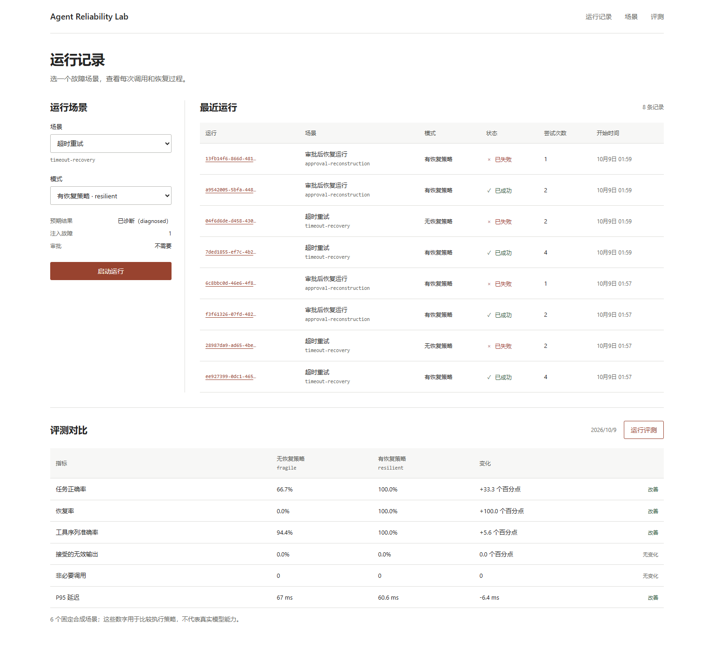

# Agent Reliability Lab

用六个固定场景检查工具重试、运行恢复和审批行为。

[English](https://github.com/SCUliujiacheng/agent-reliability-lab) · [实验结果](docs/benchmark-results.md) · [实现笔记](docs/technical-tour.md) · [CI](https://github.com/SCUliujiacheng/agent-reliability-lab-zh/actions/workflows/ci.yml)

工具第一次调用超时，重试一次通常就能继续。但如果进程刚好在写入后中断，或者两个请求同时批准同一个动作，简单地“再试一次”就不够了。运行需要知道自己停在哪一步、哪些操作已经完成，以及这次审批对应哪个动作。

这里把这些情况缩成六个可重复运行的场景：正常执行、超时、限流、无效输入、异常输出和审批后的服务重建。脚本策略与模拟工具固定下来，集中检查运行时的行为；每次尝试、状态变化和审批都会保存到 SQLite，供页面查看和评测重算。



## 实验结果

同一组场景分别运行 `fragile` 和 `resilient`。前者在工具失败后停止，后者对瞬时故障进行有界重试。默认基准不调用模型，不需要 API key、GPU 或网络。

| 指标 | Fragile | Resilient |
| --- | ---: | ---: |
| 达到预期结果的场景 | 4 / 6 | 6 / 6 |
| 瞬时故障恢复 | 0 / 2 | 2 / 2 |
| 工具序列准确率 | 94.4% | 100.0% |
| 接受的无效输出 | 0 / 8 | 0 / 11 |
| 非必要逻辑调用 | 0 | 0 |

两种模式的差异来自 `timeout-recovery` 和 `rate-limit-recovery`：注入第一次调用失败后，resilient 模式各重试一次并完成任务。这里的 6/6 只表示通过了这六个合成场景。评分从运行轨迹重新计算，定义和分母见[实验结果](docs/benchmark-results.md)，原始记录见[基线报告](benchmarks/baseline-report.json)。

## 本地运行

需要 Python 3.12+、[uv](https://docs.astral.sh/uv/) 和 Node.js 22.20+。以下单行命令兼容 PowerShell 与 Bash。

```text
git clone https://github.com/SCUliujiacheng/agent-reliability-lab-zh.git
cd agent-reliability-lab-zh
uv sync --dev --locked
npm ci --prefix web
```

在一个终端启动 API：

```text
uv run uvicorn agent_reliability_lab.api.app:create_app --factory --host 127.0.0.1 --port 8000
```

在另一个终端启动页面：

```text
npm --prefix web run dev
```

打开 `http://127.0.0.1:5173`。先运行评测，再选择 `timeout-recovery` 查看第一次失败和第二次成功之间的事件。也可以执行 `docker compose up --build` 启动完整环境。配置、开发检查和 API 说明见[本地开发](docs/local-development.md)。

## 复现与检查

```text
uv run arl eval scenarios/incident-response --output artifacts/current-report.json
uv run arl compare artifacts/current-report.json
uv run arl gate artifacts/current-report.json --baseline benchmarks/baseline-report.json
```

在干净的 Git checkout 上运行，最后一条应输出 `PASS`。检查会重算指标并核对场景、事件顺序和哈希；报告损坏或来源信息不完整时会报错。详细规则见[场景与报告说明](docs/data-and-scenario-provenance.md)。

单独运行超时场景：

```text
uv run arl run scenarios/incident-response/timeout-recovery.yaml --mode resilient --database .arl-data/demo.db --json
```

从输出复制 `run_id`，可以导出完整轨迹：

```text
uv run arl export-trace <run-id> --database .arl-data/demo.db --output artifacts/trace.json
```

## 实现上的取舍

- **先固定策略。** 脚本策略让两种模式遇到相同的工具调用与故障。可选 OpenAI 兼容适配器保留在代码中，真实模型质量需要另外评测。
- **状态与事件一起保存。** SQLite 事务负责检查点、版本检查和审批记录，重建服务后仍能接着处理等待中的动作。执行租约和幂等键用于协调重复请求。
- **审批绑定具体动作。** 客户端回传当前步骤与动作指纹；重复的相同决定可以重放，过期或冲突决定返回 HTTP 409。`actor` 只是调用方填写的标签，尚未接入身份认证。
- **限制调用次数。** 每次运行默认最多 64 次新策略调用，先持久化预留再调用；工具重试不额外计数。次数预算并不等同于总运行时限。

[实现笔记](docs/technical-tour.md)讨论并发审批、重建和评分的细节；[架构图](docs/architecture/agent-reliability-lab-architecture.html)展示 API、CLI、运行时与存储的关系。

## 局限

当前使用单节点 SQLite 和进程内执行，工具副作用全部为模拟。六个固定场景不足以代表真实事故，也没有测试 LLM 的推理质量。

项目还没有身份认证、权限管理、租户隔离或数据库迁移。多工作进程会引入新的租约与争用问题；接入真实模型后，也需要记录模型和提示词版本、重复运行并统计波动。这些都需要单独设计实验。

代码采用 [MIT License](LICENSE)。场景内容与来源见[数据说明](docs/data-and-scenario-provenance.md)。
